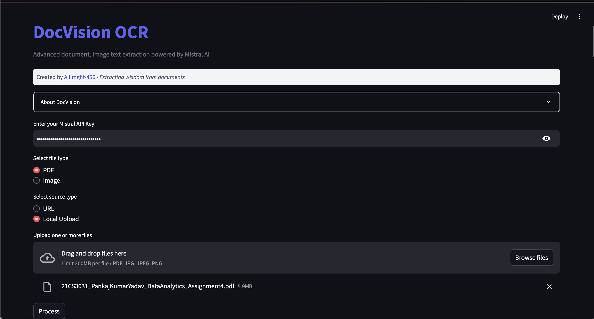
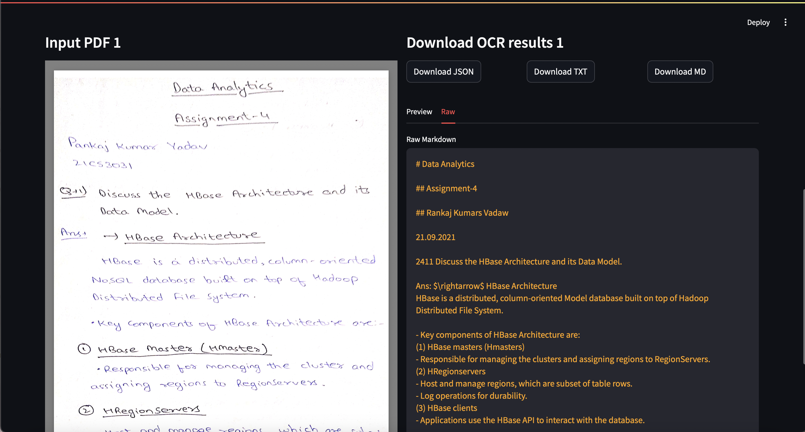

# DocVision OCR

**DocVision OCR** is a powerful Streamlit-based web application that leverages the [Mistral OCR API](https://docs.mistralai.com/) to extract text from both PDF documents and images. Users can either provide a URL or upload a local file. The app displays the original document (or image) in a preview alongside the extracted OCR results with multiple download options.
[](https://docvision.streamlit.app)
[Checkout App](https://docvision.streamlit.app)
## ✨ Features

- **Multi-Format Support:** Process both PDFs and images (JPG, PNG formats)
- **Flexible Input Methods:** Choose between URL input or local file uploads
- **Real-Time Preview:** See your documents alongside the extracted text
- **Multiple Export Options:** Download results in JSON, TXT, or Markdown formats
- **Tabbed Results View:** Toggle between rendered preview and raw text
- **Interactive Interface:** Clean, responsive design built with Streamlit


## 🚀 Installation

### Prerequisites

- Python 3.7 or later
- [Streamlit](https://streamlit.io/)
- [Mistralai Python Client](https://pypi.org/project/mistralai/)

### Steps

1. **Clone the Repository:**

   ```bash
   git clone https://github.com/Allmight-456/OCR_pdf_image_url_reader.git
   cd OCR_pdf_image_url_reader
   ```

2. **Create and Activate a Virtual Environment (Optional but Recommended):**

   On macOS/Linux:
   ```bash
   python -m venv venv
   source venv/bin/activate
   ```

   On Windows:
   ```bash
   python -m venv venv
   venv\Scripts\activate
   ```

3. **Install Required Dependencies:**

   Create a `requirements.txt` file (if not already present) with:
   ```plaintext
   streamlit
   mistralai
   ```

   Then install them:
   ```bash
   pip install -r requirements.txt
   ```

4. **Set Up Your Mistral API Key:**

   The app requires a Mistral API key. Export your API key as an environment variable:

   - On macOS/Linux:
     ```bash
     export MISTRAL_API_KEY=your_api_key_here
     ```

   - On Windows (Command Prompt):
     ```bash
     set MISTRAL_API_KEY=your_api_key_here
     ```

## 📖 Usage

1. **API Key Entry:**  
   Enter your Mistral API key in the provided field.

2. **File Type & Source Selection:**  
   Choose whether you want to process a **PDF** or an **Image** and select the source type—either via a URL or by uploading local files.

3. **Processing:**  
   Click the **Process** button to extract text using Mistral's OCR technology. The app then:
   - Displays the original document in the left panel
   - Shows the extracted OCR results in the right panel with tabbed interface
   - Provides multiple download formats for the extracted content

4. **Results and Download:**  
   - View results in either "Preview" or "Raw" formats via the tab interface
   - Download results in your preferred format (JSON, TXT, or MD) using the styled download buttons
   - All downloads preserve application state without refreshing the page


## 🔧 Code Overview

- **main.py:**  
  The main Streamlit application file that contains:
  - User interface with custom styling and responsive layout
  - Document handling for both URLs and local uploads
  - Mistral OCR API integration
  - Preview rendering with tabbed interface
  - Multiple export format options with styled buttons
  
- **README.md:**  
  Project documentation with installation and usage instructions.

- **requirements.txt:**  
  Required Python dependencies.

## 👨‍💻 Contributing

Contributions are welcome! If you have suggestions or find issues, please feel free to:
- Open an issue in the repository.
- Submit a pull request with improvements or bug fixes.

## 📄 License

This project is licensed under the [MIT License](LICENSE).

## 🙏 Acknowledgements

- [Streamlit](https://streamlit.io/) for making interactive web app development easy.
- [Mistralai](https://github.com/mistralai) for their powerful OCR API and Python client.

## 📬 Contact

Created by [Allmight-456](https://github.com/Allmight-456). For any questions or support, please open an issue in the [GitHub repository](https://github.com/Allmight-456/OCR_pdf_image_url_reader).
